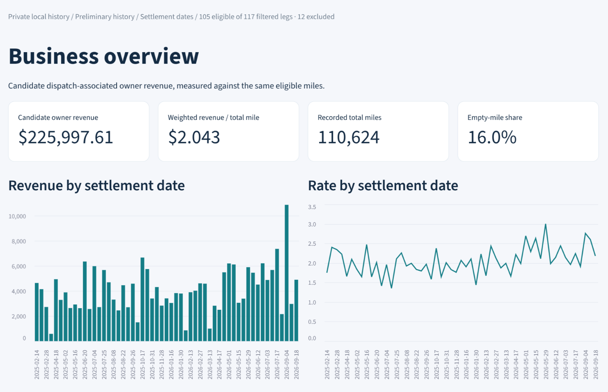
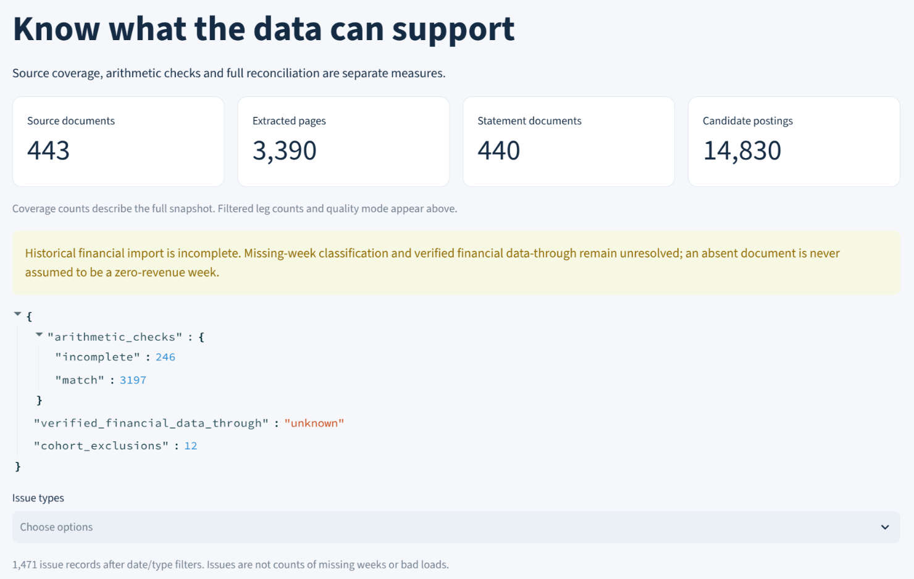

# Prime Proof Lab

### Trucking settlement analytics and a source-linked review desk

Which freight lanes have paid well, and which figures are reliable enough to compare? This project turns owner-operator business rules into a local SQL reporting model, four interactive dashboards, and a review workflow that keeps decisions tied to their source records.

**Working prototype · Python / SQLite / Streamlit · Linux · Reproducible synthetic demo**

[Dashboard screenshots](docs/OPERATIONAL_SCREENSHOTS.md) · [Synthetic demo tour](docs/VISUAL_TOUR.md) · [Business case study](docs/CASE_STUDY.md) · [Architecture](docs/ARCHITECTURE.md) · [Skill and test evidence](docs/EVIDENCE_MAP.md)



*Operator-supplied screenshot of the private local installation. This filtered view contains 105 eligible legs out of 117 and remains preliminary. Browser chrome and source identifiers have been removed; the retained chart and metric pixels are unchanged. The downloadable demo uses separate fictional records.*

## The business problem

A trucking settlement contains more than load revenue: reimbursements, fuel, repairs, reserve movements, trainee payroll and later adjustments can appear together. Repowered loads and repeated invoice detail complicate comparisons. A weekly payout alone cannot explain which freight is attractive.

Chris Sheppard supplied the owner-operator requirements and business rules for a system that makes historical freight comparisons inspectable. The current prototype demonstrates the reporting and review foundation; complete historical reconciliation and dispatch recommendations remain future work.

## What you can do

| Screen | Business question | Implemented behavior |
|---|---|---|
| **Business Overview** | What does this selection actually tell me? | Weighted revenue per total mile, eligible/excluded counts, mileage mix and separately labeled settlement cash |
| **Freight and Lane History** | How has freight on this lane compared? | Historical lane filters, minimum sample size and individual source legs with exclusion reasons |
| **Data Quality and Sources** | How much of the source data can I trust? | Source coverage, arithmetic checks, unresolved issues and explicit preliminary/reconciled states |
| **Settlement Review Desk** | What needs a human decision? | Original PDF/text inspection, documented decisions, persistent history and controlled category/facility mappings |



*The captured installation reports 443 source documents, 3,390 extracted pages, 440 statement documents and 14,830 candidate postings. These are screenshot-reported counts, not an independent certification of complete ingestion or financial reconciliation. See all four screens in the [operational gallery](docs/OPERATIONAL_SCREENSHOTS.md).*

## The decisions behind the numbers

- **Use the same loads on both sides of the rate calculation.** Weighted RPM is total eligible owner revenue divided by those same legs' total miles, including empty miles.
- **Keep uncertainty visible.** Unknown miles stay unknown. Ambiguous repower allocations remain in detail but are excluded from rate calculations.
- **Preserve the correct level of detail.** A load leg contributes its amount once; repeated stops and invoice pages must not multiply it.
- **Separate cash from earnings.** A reserve release and a trainee's total gross pay are not automatically freight revenue or the owner's payroll cost.
- **Make review decisions recoverable.** Duplicate-request checks, source-version checks, backups and recovery keys support the implemented nonfinancial changes.

The [case study](docs/CASE_STUDY.md) explains these choices with worked examples.

## Evidence you can inspect

**65 automated tests passed in an independent rerun on September 28, 2026.** The [test log](evidence/repository_preparation_unittest.txt) and [verification record](evidence/repository_preparation_validation.json) cover the supplied synthetic release. Tests exercise calculation rules, SQL/CSV/JSON consistency, all four Streamlit pages, decision persistence, conflicts, rollback and recovery.

The [visual tour](docs/VISUAL_TOUR.md) contains the supplied release's actual screenshots and explains what each demonstrates. That separate browser smoke run was not repeated during repository preparation. The [evidence map](docs/EVIDENCE_MAP.md) connects each skill to its implementation and checks.

The additional [operational screenshots](docs/OPERATIONAL_SCREENSHOTS.md) were supplied by the operator on September 28, 2026. They show the private installation at a larger scale and are retained separately from the synthetic test evidence. No direct connection to that localhost session or independent database audit was performed for this screenshot update.

**Contribution:** Chris supplied domain requirements and business acceptance rules. Implementation and validation were assisted by Codex. This is an independent portfolio and business-system project, not an official Prime product.

## Run the demo on Linux

Prerequisites: `uv`, Python 3.13 managed by `uv`, Poppler's `pdftoppm` for source-page rendering, and a browser. From this repository's directory:

```bash
uv sync --frozen
.venv/bin/python prime_dashboard.py demo
.venv/bin/python prime_dashboard.py serve
```

Open <http://127.0.0.1:8501>. Stop with `Ctrl+C`. The demo uses fictional records under `demo/runtime`, excluded from Git, and needs no Microsoft account or hosted database.

Follow the [two-minute walkthrough](docs/DEMO.md). To run the automated suite:

```bash
.venv/bin/python -m unittest discover -s tests -v
```

The demo creates fictional PDFs and seeds extraction/structured records directly. It demonstrates reporting and review; it is not an end-to-end OCR import of the private settlement archive. See the [operating guide](docs/DASHBOARD_GUIDE.md) for explicit private-data launch, snapshots and paired backups.

## Scope and next milestones

| Available here | Still to establish |
|---|---|
| Working local dashboard and review prototype | Full historical financial reconciliation and verified weekly coverage |
| Nine SQL reporting tables, matching CSV/JSON and dated snapshots | Complete economic cost classification and trip-profit analysis |
| Tested category/facility review paths | Applying numeric/date corrections through this UI; city/state-only facility confirmation |
| Power Query and DAX preparation files | A verified Power BI Desktop report |

Live freight availability, radius search, route fuel/tax optimization and reload predictions are outside this release. No revenue improvement or cost-saving result has been measured. The [known limitations](docs/KNOWN_LIMITATIONS.md) document the remaining work.

The separate [Power Platform lab](https://github.com/christopher-sheppard/prime-power-platform-portfolio) is being built with Power Apps, Dataverse and Power Automate. It records a reported Canvas publication checkpoint, but Power Automate Save is currently blocked by `FlowNotOriginalAuthor`; no successful processor run is verified. See [current Microsoft status](powerplatform/STATUS.md). The original 18-load freight-selection case study is also separate from this synthetic demonstration.

## Find your way around

| Path | Contents |
|---|---|
| [sql/](sql/) | Schema migrations and query examples |
| [analytics/](analytics/) | Reporting tables, shared metrics and snapshot exports |
| [dashboard/](dashboard/) | Four Streamlit screens |
| [review/](review/) | Decision journal and validated mapping writer |
| [demo/](demo/) | Deterministic fictional fixtures |
| [tests/](tests/) / [evidence/](evidence/) | Automated checks, screenshots and dated results |
| [powerbi/](powerbi/) | Power Query and DAX preparation |
| [docs/](docs/) | Case study, architecture, reporting contract and operating guides |

[Release provenance](docs/REPOSITORY_PROVENANCE.md) records the supplied baseline and independent verification. Existing private installations and newer workstation work are maintained separately from this portfolio snapshot.

The [original release notes](Jobs_Prime_Release/) and [archive manifest](release_manifest.json) describe the September 28 input archive before repository publication. Their publication and Microsoft-workflow status statements are historical; see [current Microsoft status](powerplatform/STATUS.md) for the separately tracked Power Platform build.
