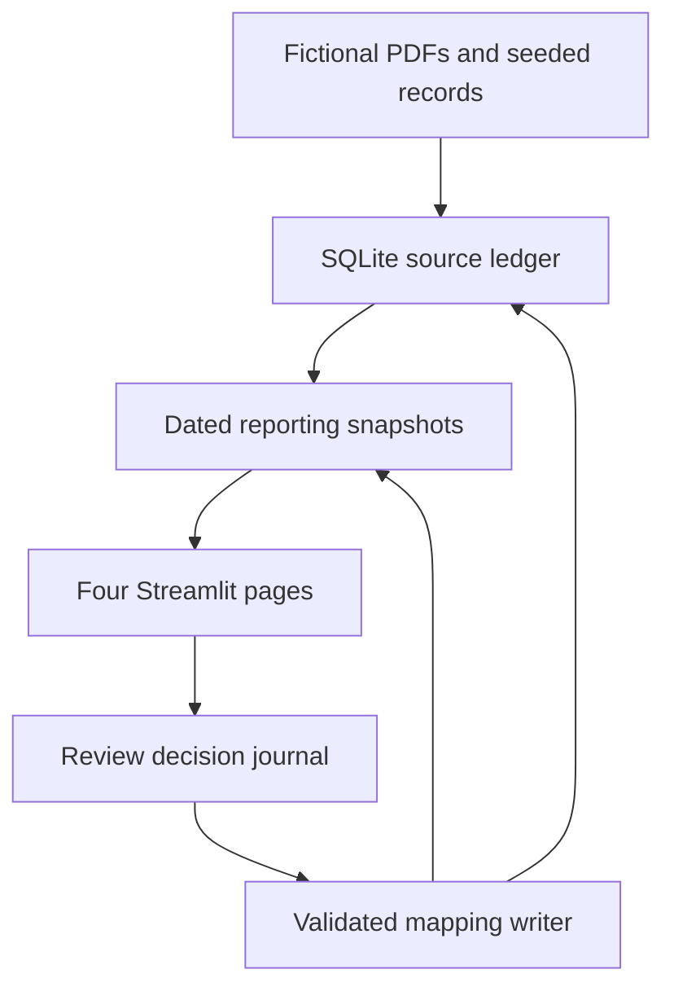

# Architecture and SQL model

[README](../README.md) · [Reporting contract](REPORTING_CONTRACT.md) · [Implementation decisions](DECISIONS.md)

## Local application flow

The default demonstration runs locally on Linux. [demo/generate.py](../demo/generate.py) creates fictional PDFs and directly seeds source-page and structured records, including deliberately difficult cases. It does not run a complete historical OCR ingestion pipeline. [prime_dashboard.py](../prime_dashboard.py) creates a reporting batch and starts the application bound to localhost.

The dashboard reads a dated reporting snapshot. Source inspection resolves the associated document/page in the source ledger. A separate review journal preserves decisions and events through retries and failures.

## What the SQL tables mean

The source layer retains documents, occurrences, extraction/parse revisions, candidate lines, checks and issues. [SQL migrations](../sql/) define those structures. The reporting adapter exposes nine tables:

| Table | One row represents | Use |
|---|---|---|
| `FactStatement` | One current statement document | Statement amounts, owner/unit identity and cash due |
| `FactLoadLeg` | One current source load leg | Revenue/mileage comparisons without stop or invoice duplication |
| `FactPosting` | One source posting line | Amounts, raw codes, descriptions and pending classification |
| `FactReviewIssue` | One current source issue or party review | Review queue and unresolved quality findings |
| `DimDate` | One calendar date | Settlement/posting date analysis |
| `DimOperatingPeriod` | One evidenced operating interval | Supported periods and an explicit unknown member |
| `DimOrigin` | One raw origin city/jurisdiction tuple | Lane grouping by origin |
| `DimDestination` | One raw destination city/jurisdiction tuple | Lane grouping by destination |
| `SourceRecord` | One review subject | Document/page/line reference, original value and revision fingerprint |

Reporting tables have primary keys. Their logical relationships are carried in identifier fields; the reporting export does not declare foreign-key constraints between these tables. The source ledger has its own enforced constraints and integrity checks.

Money stays in signed integer cents; unknowns remain SQL `NULL`; codes remain text. Geography is raw/unverified unless separately supported. Facility decisions do not automatically bind route cities to verified facilities. The [reporting contract](REPORTING_CONTRACT.md) specifies the exact eligibility rules and field semantics.

## Consistent exports

[analytics/reporting.py](../analytics/reporting.py) takes a consistent SQLite backup, validates it, and creates `reporting.sqlite`, matching CSV/JSON tables, a schema-derived data dictionary and a manifest with counts and hashes. The `latest.json` pointer changes only after a batch completes. A failed publication leaves the prior batch selected.

A snapshot can be retained independently of the running application. Access from another device or an assistant still requires transferring or sharing that snapshot; this repository does not configure a continuously available remote service.

## Review and recovery

[review/service.py](../review/service.py) records a required reason, evidence reference, reviewer label and unique request ID. A repeated request with the same payload returns the existing decision; a conflicting payload is rejected. Source revisions and value fingerprints are checked again before application.

Category/facility mappings have a supported writer with a source backup, a database transaction and integrity validation. A unique applied-decision key in the ledger supports recovery when a write succeeds but acknowledgement is interrupted. The source ledger and review journal do not share a distributed transaction.

Numeric/date proposals remain recorded for later review and targeted reprocessing. Local reviewer labels are not enterprise authentication. The [evidence map](EVIDENCE_MAP.md) identifies the checks for each implemented path.
