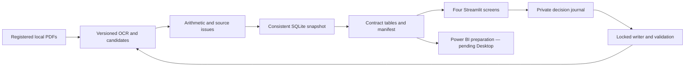

# Linux dashboard and operational review desk

Built from the verified revision 1.1 specification. The application is local and works without a Microsoft account. Source/report reads use SQLite read-only connections. Decisions use a separate journal; a controlled writer applies only supported nonfinancial changes.

## Setup and launch

Python 3.13, uv, Poppler (`pdftoppm`) and a browser are required. The locked Python dependencies are in `uv.lock`.

```bash
uv sync --frozen
.venv/bin/python prime_dashboard.py demo
.venv/bin/python prime_dashboard.py serve
```

Open http://127.0.0.1:8501. The default is independently authored synthetic data under `demo/runtime`. It does not read `~/PrimeData`. The dataset badge is visible on every screen. Source rendering uses local Poppler; charts need no external map service or CDN.

For the existing private archive:

```bash
.venv/bin/python prime_dashboard.py refresh --private
.venv/bin/python prime_dashboard.py serve --private
```

Use `--data-root /absolute/path` for another installation and `--port 8502` for a second process. Stop a running server with Ctrl+C before using its port for another dataset. The launcher binds only to `127.0.0.1` and disables usage telemetry. It never launches an importer or OCR process.

`refresh` installs the additive review-desk migration with a verified backup, creates a consistent source snapshot, and atomically publishes a pointer only after the reporting batch succeeds. The dated folders are under `<root>/reporting/`; they contain source.sqlite, reporting.sqlite, matching table CSV/JSON exports, a data dictionary and a manifest with hashes. Refresh after an import or reparse; the application does not silently refresh financial evidence on each page view.

## Four screens

- **Business Overview:** paired revenue and mileage eligibility, weighted total-mile RPM, miles and empty share. Statement cash is separately scoped by settlement dates and document type; it does not inherit leg or crew filters.
- **Freight and Lane History:** raw pickup/destination labels, exact raw SOLO/TEAM filter, evidenced era filter, sample threshold, weighted versus median/range rates, contributing/excluded legs and original-source drill-through. Unknown eras and facilities remain explicit.
- **Data Quality and Sources:** full-snapshot document/page/posting counts, filtered issue list, incomplete arithmetic and source-through limitations. Missing-week classification is still unresolved.
- **Settlement Review Desk:** issue/type/date search, original PDF page alongside cached OCR, structured proposal, reason, evidence reference, local reviewer label, application result and immutable history.

The latest two years and raw SOLO are initial display filters where available. These are choices the operator can change. Every page shows dataset, quality mode, snapshot and cohort counts. Reconciled mode never substitutes preliminary rows when empty. Source dates are settlement dates, not pickup/delivery dates.

## Supported review actions

| Action | Actual result |
|---|---|
| Defer | Durable note; source issue stays unresolved |
| Confirm/reject category | Versioned classification of this exact source record; original code and financial figures remain unchanged |
| Confirm facility | Versioned mapping of an invoice-party observation to explicitly supplied organization/facility evidence; separate plants use different facility keys |
| Numeric/date correction | Recorded pending proposal; not applied by this interface |

Facility confirmation requires a street address, city, jurisdiction, postal code, role, reason and evidence. A location is not geocoded. Existing organization/facility keys cannot silently acquire different names or addresses: use a new facility version key, preserving old evidence. Role-specific raw codes stay associated with the evidence. These mappings do not automatically bind raw route cities to facilities or make legs reconciled.

Category decisions are record-specific observations, not broad rules inferred from a code and not automatic financial reclassification. A later allocation/classification build must validate how these affect economic totals. A rejected proposal remains in history. To reverse or amend a decision, refresh the source record and start another decision; never delete history.

## Storage, concurrency and recovery

`<root>/review/review.sqlite` stores immutable decisions and state events. The request ID is unique; the same request/content returns the previous result. Reusing an ID for different content is rejected. Use **Start another decision** when deliberately making a new proposal.

Stable record identity combines source document SHA-256 with source kind and an exact locator (page/role, check name, or line/text/issue evidence). Parse ID alone is never a stable record key. Current revision includes extraction/parse identity and applied-review head; a value fingerprint separately detects changed evidence. Ambiguous or unresolvable records require re-review.

Apply takes the import/extraction advisory locks, validates the registered PDF and source revision, backs up the ledger, starts a short write transaction, validates again, writes append-only decision/mapping evidence, and checks integrity and foreign keys before commit. Reporting is refreshed only after commit and validation. Failure before commit rolls back the entire mapping. A publication failure preserves the prior published reporting pointer and displays a failed-publication message.

The journal and ledger are separate databases, not a distributed atomic transaction. `desk_applied_changes.decision_id` is the unique authoritative applied-change key. If a process dies after ledger commit but before journal acknowledgement, retry finds that key and repairs the acknowledgement without applying another change. A failed snapshot publication uses the same recovery path. Do not remove either store independently.

Back up both stores under the normal writer locks:

```bash
.venv/bin/python prime_dashboard.py backup --private
```

This creates a consistent ledger backup and a separate SQLite-backup copy of the journal, both with the same filename stem. Original PDFs must be backed up separately. The journal is review state, not a second ledger.

To restore, stop the app/importer, restore the selected ledger to `<root>/database/prime.sqlite` and its paired journal to `<root>/review/review.sqlite`, restore the source archive, then run `refresh`. Run integrity/foreign-key checks and reconcile pending decisions by their applied-change IDs before new applications. A reporting source snapshot can be restored/query-tested independently, but it does not replace a paired journal/source backup.

## Architecture and boundaries



The existing parser, corrected OCR, 13 source-image reviews and prior financial candidates are preserved. The app adds migration 007 and a reporting layer. The journal never marks a complete statement reconciled. No live offers, geocoded radius search, inferred reload chronology, trip profit or trainee-expense assumptions are generated.

## Testing

```bash
.venv/bin/python -m unittest discover -s tests -q
.venv/bin/python tests/browser_smoke.py
```

The second command requires a running synthetic server at port 8501, installed Chromium and the locked development dependency Playwright. It navigates all four pages, checks source rendering, saves a defer note, reloads the browser, and records screenshots of synthetic data only. `--private --url http://127.0.0.1:8502 --output /private/report/path` checks private page/source rendering without screenshots or business decisions.

Automated coverage includes unequal-distance RPM, matching numerator/denominator exclusions, repeated invoices/multiple stops, same-date statements, selected revisions, repowers, trainee gross versus owner charge, empty reconciled mode, CSV/SQL agreement, snapshot restore, persistent decisions, duplicate requests, stale source/value checks, two plants under one organization, validation rollback, missing PDFs and post-commit recovery. These checks do not certify the full historical archive.

AppTest exercises actual Streamlit widgets, with a separate Chromium run for browser rendering. See [Streamlit's AppTest reference](https://docs.streamlit.io/develop/api-reference/app-testing/st.testing.v1.apptest) for the distinction between simulated app execution and browser checks.
