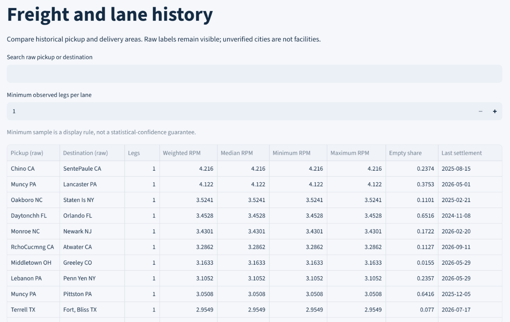
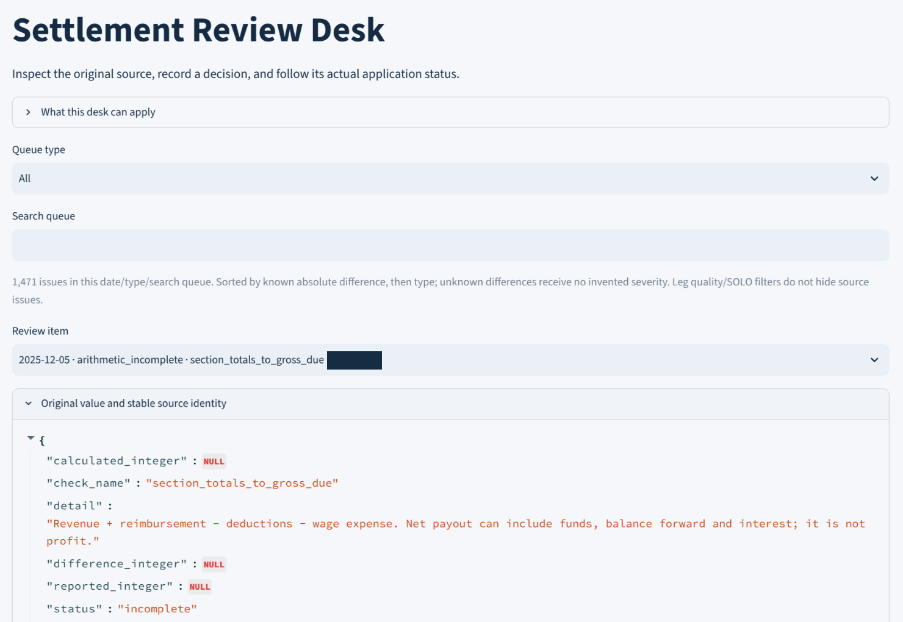

# Operational screenshot gallery

[README](../README.md) · [Reproducible synthetic demo](VISUAL_TOUR.md) · [Skill and test evidence](EVIDENCE_MAP.md)

These four images came from the operator's private local dashboard and were supplied on September 28, 2026. They demonstrate the visible application state on real historical records. They are separate from the fictional dataset packaged with this repository.

The images were cropped directly from the originals. Browser tabs, the address bar, sidebar snapshot identifiers and source-ID table rows were excluded; the selected review item's identifier received a solid opaque mask. Retained pixels are otherwise identical to the originals. Aggregate business metrics, raw lane cities and historical dates remain visible. No generated imagery is used in this gallery.

## Business Overview

The captured selection contains **105 eligible legs out of 117**, with **12 excluded**. It displays candidate owner revenue, weighted revenue per total mile, total miles and empty-mile share, with charts by settlement date. The original sidebar selected **SOLO**, the date range **2024-09-18 through 2026-09-18**, and **Preliminary history**.

These figures describe the captured filtered selection. They are not lifetime earnings, verified profit or a measured improvement caused by the application. The same eligible legs supply revenue and mileage for the rate calculation.

## Freight and Lane History

The screen compares raw pickup/destination labels and shows weighted, median, minimum and maximum rates alongside empty-mile share and recency. The original sidebar used **All** for SOLO/TEAM and the same date range as above; this is not necessarily the same selection as the Business Overview screenshot.

The minimum observed legs is set to **1**. The visible rows each have one observation, so they demonstrate the comparison interface rather than reliable estimates of future rates. Raw OCR spellings remain unchanged; they are not verified facility names or addresses.

## Data Quality and Sources

The captured installation reports:

| Measure | Displayed count |
|---|---:|
| Source documents | 443 |
| Extracted pages | 3,390 |
| Statement documents | 440 |
| Candidate postings | 14,830 |

The original warning remains visible: historical financial import is incomplete, missing-week classification is unresolved and an absent document is not assumed to mean zero revenue. The displayed **1,471 issue records** are not a count of missing weeks or bad loads. Arithmetic checks and complete financial reconciliation are separate measures.

These are observed screen values. The underlying private database was not independently audited as part of this screenshot preparation.

## Settlement Review Desk

The selected issue shows an incomplete check relating section totals to gross due. Its original `NULL` values and incomplete status remain visible. The dark box hides the source record identifier. This view demonstrates the issue queue and original-value inspection; it does not show a financial correction being applied or a completed reconciliation.

## Provenance and preparation checks

The [redaction manifest](../evidence/private-history-redacted/redaction_manifest.json) records original-image hashes, crop coordinates, the mask rectangle, output hashes and pixel-comparison results. All retained pixels outside the mask matched the source images exactly. Outputs were checked visually and with OCR for visible personal names/contact details, local paths and source identifiers; embedded EXIF/XMP/IPTC/ICC metadata is absent.

The capture was supplied by the operator; the preparation environment could not reach the PC's `localhost`. The private installation's exact code revision was not established from these images. These screenshots supplement the [synthetic test evidence](EVIDENCE_MAP.md), without changing its scope or the project's [known limitations](KNOWN_LIMITATIONS.md).
