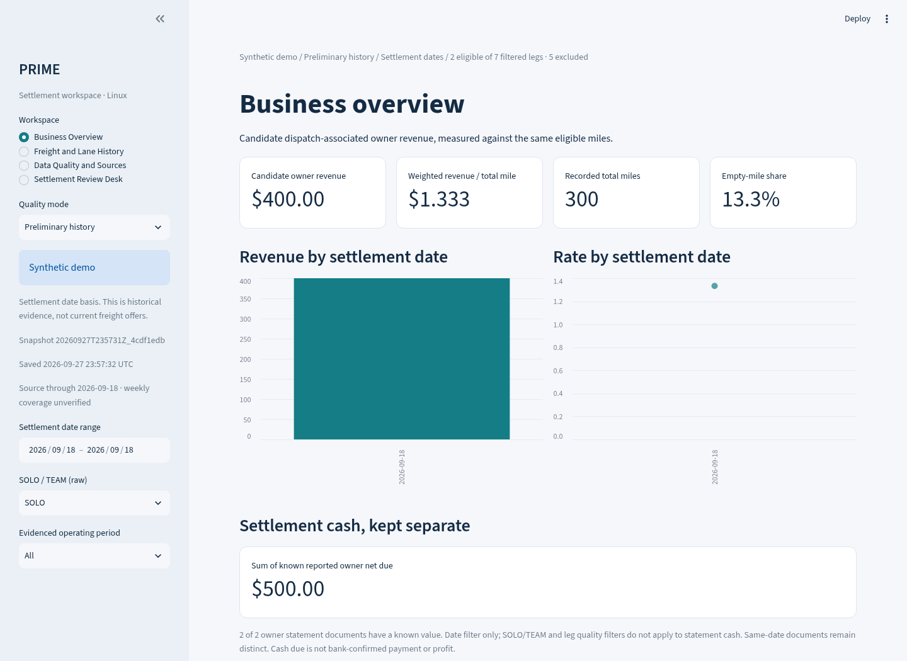
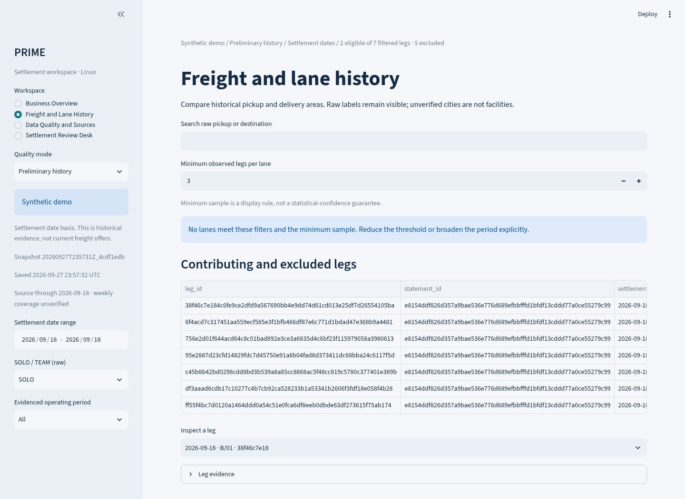
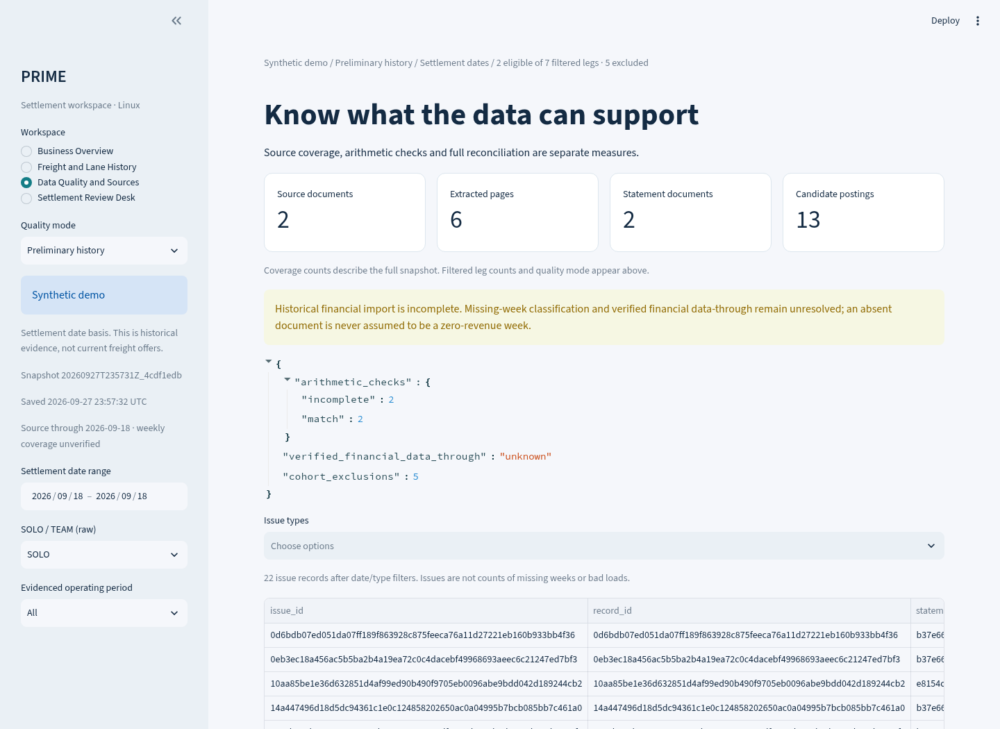
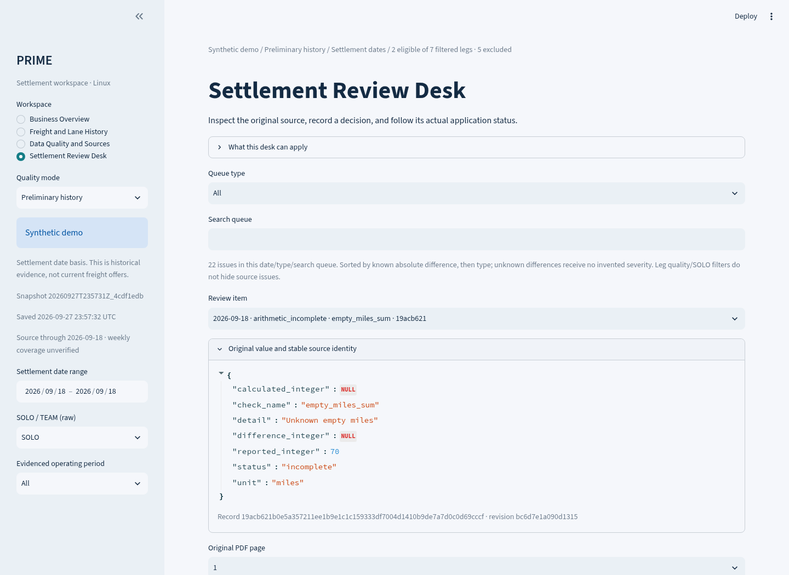
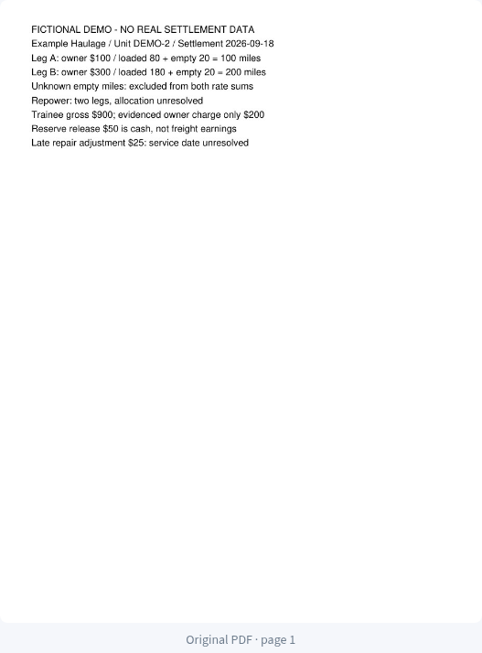
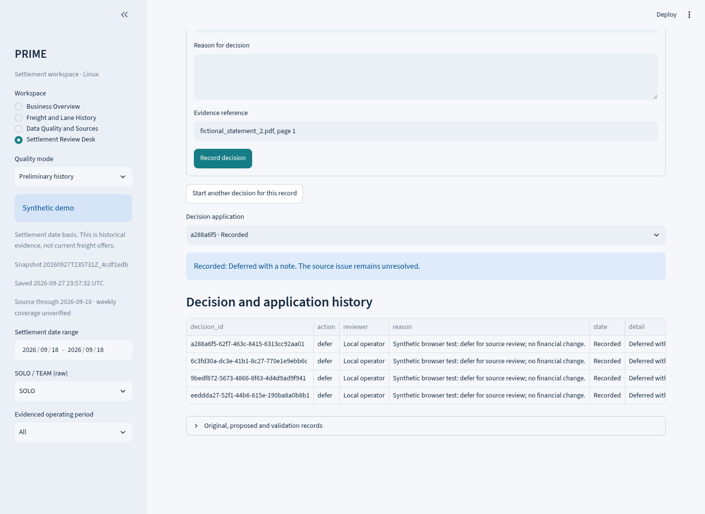

# Visual tour

[README](../README.md) · [Case study](CASE_STUDY.md) · [Run the demonstration](DEMO.md)

These are actual screenshots supplied with the synthetic 1.1 release. They show fictional records, not private settlements. The [browser result](../evidence/browser/result.json) records the supplied run; repository preparation independently reran the automated suite, not this browser session.

## 1. Business Overview: understand the selection

The screen shows the selected dataset, snapshot, quality mode and eligible/excluded counts alongside the metrics. The two eligible legs produce $400 / 300 miles = $1.333 per total mile. Cash due is labeled separately. The single-date fixture is a functionality example, not a historical performance trend.

**Demonstrates:** visible calculation scope, weighted aggregation and separately labeled settlement cash.

## 2. Freight and Lane History: respect the sample size

This screenshot has no qualifying lane because its minimum sample is three and the fixture has only two eligible legs. In the running demo, lower the threshold to two to display the fictional lane. Detailed records retain excluded legs and their reasons.

**Demonstrates:** filtering and sample-size handling. It does not show a ranked list of proven best-paying real lanes.

## 3. Data Quality and Sources: see what is unresolved

Source counts, arithmetic checks and unresolved issues are visible together. The screenshot's 22 review issues are issue records; they are not 22 missing weeks or 22 bad loads. Arithmetic agreement is one check, not complete source reconciliation.

**Demonstrates:** transparent quality reporting and explicit limits on the available data.

## 4. Settlement Review Desk: inspect the original value

The selected issue keeps its source identity, revision, original values and units. The reviewer can inspect source text and the original PDF before recording a reasoned decision.

**Demonstrates:** a review path back to an actual source page. This PDF was authored for the demo; it is not an anonymized customer statement.

## 5. Decision history: distinguish recorded from applied

The visible action is **Deferred with a note**. Its history persists after reload, while the source issue remains unresolved. Category/facility mappings have a separate application path tested in the automated suite; this screenshot does not claim a financial correction was applied.

**Demonstrates:** durable review history and an honest workflow status.

Use the [two-minute walkthrough](DEMO.md) to reproduce these steps. The [evidence map](EVIDENCE_MAP.md) links duplicate requests, stale values, rollback and recovery to their tests.
